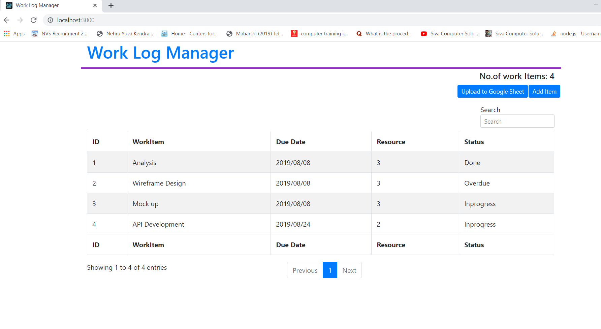

# Work Log Manager

### Setup

1. Clone this project
2. cd  <project>
3. npm install
4. npm start 
5. Open browser and type `http://localhost:3000`

### UI

### References

- https://mdbootstrap.com/docs/react/tables/editable/
- https://devexpress.github.io/devextreme-reactive/react/grid/docs/guides/getting-started/
- https://devexpress.github.io/devextreme-reactive/react/grid/demos/featured/data-editing/